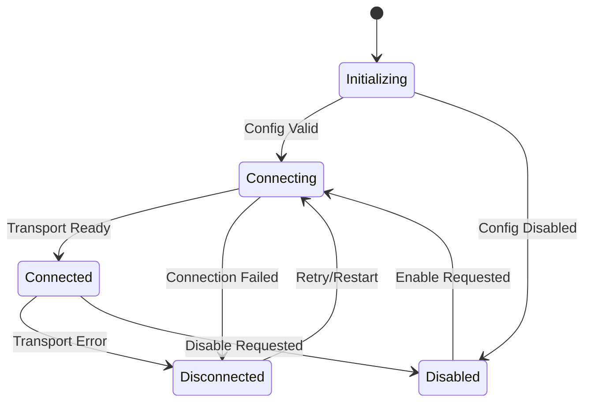

# Unlocking Specialized Capabilities with MCP: Cline's Architecture for External Tool Integration

## Executive Summary

The Model Context Protocol (MCP) represents a paradigm shift in how AI agents access and interact with external systems. Rather than being limited to built-in tools, MCP enables Cline to dynamically discover, connect to, and orchestrate specialized tools from a growing ecosystem of external services, APIs, databases, and custom implementations.

This document provides an in-depth analysis of how Cline leverages MCP to unlock capabilities that extend far beyond local code execution, examining the sophisticated architecture, algorithms, and design patterns that make this extensibility both powerful and secure.

**Why MCP Makes Cline Exceptional:**
- **Dynamic Capability Extension**: Tools are discovered and integrated at runtime, not compile-time
- **Ecosystem Leverage**: Access to specialized tools for databases, APIs, cloud services, and domain-specific tasks
- **Security Through Isolation**: Each MCP server runs in its own process with configurable permissions
- **Progressive Enhancement**: Seamless degradation when external tools are unavailable
- **Real-time Adaptation**: Hot-reloading of tool configurations without system restart

## Table of Contents

1. [MCP Architecture Foundation](#mcp-architecture-foundation)
2. [Server Discovery and Connection Management](#server-discovery-and-connection-management)
3. [Transport Layer Abstraction](#transport-layer-abstraction)
4. [Tool Integration and Execution Pipeline](#tool-integration-and-execution-pipeline)
5. [Resource Management and Context Handling](#resource-management-and-context-handling)
6. [Security Model and Sandboxing](#security-model-and-sandboxing)
7. [Configuration Management and Hot-Reloading](#configuration-management-and-hot-reloading)
8. [Marketplace Integration and Tool Discovery](#marketplace-integration-and-tool-discovery)
9. [Error Handling and Resilience Patterns](#error-handling-and-resilience-patterns)
10. [Performance Optimization and Scaling](#performance-optimization-and-scaling)

## MCP Architecture Foundation

### The MCP Hub: Central Orchestration

The `McpHub` class serves as the central nervous system for all MCP operations in Cline. Unlike a simple service registry, it implements a sophisticated connection management system with real-time monitoring, hot-reloading, and intelligent error recovery.

```typescript
export class McpHub {
    connections: McpConnection[] = []
    isConnecting: boolean = false
    
    // Real-time notification system
    private pendingNotifications: Array<{
        serverName: string
        level: string
        message: string
        timestamp: number
    }> = []
    
    // Live configuration monitoring
    private settingsWatcher?: FSWatcher
    private fileWatchers: Map<string, FSWatcher> = new Map()
    
    constructor(
        getMcpServersPath: () => Promise<string>,
        getSettingsDirectoryPath: () => Promise<string>,
        clientVersion: string,
        telemetryService: TelemetryService,
    ) {
        this.watchMcpSettingsFile()
        this.initializeMcpServers()
    }
}
```

**Architectural Insight**: The hub pattern centralizes complexity while providing clean interfaces to consuming components. Each MCP server gets its own isolated connection, preventing cross-contamination while enabling sophisticated coordination.

### Connection Management State Machine

Each MCP connection follows a well-defined state machine that ensures reliable operation:



**State Management Design**: The state machine is implemented through status tracking on each connection object, with explicit state transitions that trigger appropriate UI updates and error handling.

### Multi-Transport Architecture

Cline supports three distinct transport mechanisms, each optimized for different deployment scenarios:

```typescript
type Transport = StdioClientTransport | SSEClientTransport | StreamableHTTPClientTransport

type McpConnection = {
    server: McpServer
    client: Client
    transport: Transport
}
```

**Transport Selection Algorithm:**
1. **STDIO**: Local processes, development servers, trusted local tools
2. **SSE (Server-Sent Events)**: Remote servers requiring real-time bidirectional communication
3. **HTTP Streaming**: Cloud services, stateless APIs, load-balanced deployments

## Server Discovery and Connection Management

### Configuration-Driven Discovery

Unlike hardcoded tool definitions, Cline uses a dynamic configuration system that allows runtime discovery and hot-reloading of MCP servers:

```typescript
private async readAndValidateMcpSettingsFile(): Promise<z.infer<typeof McpSettingsSchema> | undefined> {
    try {
        const settingsPath = await this.getMcpSettingsFilePath()
        const content = await fs.readFile(settingsPath, "utf-8")
        
        let config: any
        
        // Robust JSON parsing with error handling
        try {
            config = JSON.parse(content)
        } catch (_error) {
            HostProvider.window.showMessage({
                type: ShowMessageType.ERROR,
                message: "Invalid MCP settings format. Please ensure your settings follow the correct JSON format.",
            })
            return undefined
        }
        
        // Schema validation with user feedback
        const result = McpSettingsSchema.safeParse(config)
        if (!result.success) {
            HostProvider.window.showMessage({
                type: ShowMessageType.ERROR,
                message: "Invalid MCP settings schema.",
            })
            return undefined
        }
        
        return result.data
    } catch (error) {
        console.error("Failed to read MCP settings:", error)
        return undefined
    }
}
```

### Live Configuration Monitoring

One of Cline's most sophisticated features is its ability to detect configuration changes and hot-reload MCP servers without interrupting the user's workflow:

```typescript
private async watchMcpSettingsFile(): Promise<void> {
    const settingsPath = await this.getMcpSettingsFilePath()
    
    this.settingsWatcher = chokidar.watch(settingsPath, {
        persistent: true,
        ignoreInitial: true,
        awaitWriteFinish: {
            // Handle chunked writes from editors
            stabilityThreshold: 100,
            pollInterval: 100,
        },
        atomic: true, // Handle atomic writes (temp file -> rename)
    })
    
    this.settingsWatcher.on("change", async () => {
        const settings = await this.readAndValidateMcpSettingsFile()
        if (settings) {
            try {
                await this.updateServerConnections(settings.mcpServers)
            } catch (error) {
                console.error("Failed to process MCP settings change:", error)
            }
        }
    })
}
```

**Hot-Reloading Strategy**: The system uses file watching with atomic write detection to ensure configuration changes are applied cleanly, even when editors use temporary files or chunked writes.

### Intelligent Connection Updates

The connection update algorithm implements sophisticated change detection to minimize disruption:

```typescript
async updateServerConnections(newServers: Record<string, McpServerConfig>): Promise<void> {
    this.isConnecting = true
    this.removeAllFileWatchers()
    
    const currentNames = new Set(this.connections.map((conn) => conn.server.name))
    const newNames = new Set(Object.keys(newServers))
    
    // Delete removed servers
    for (const name of currentNames) {
        if (!newNames.has(name)) {
            await this.deleteConnection(name)
            console.log(`Deleted MCP server: ${name}`)
        }
    }
    
    // Update or add servers with deep equality check
    for (const [name, config] of Object.entries(newServers)) {
        const currentConnection = this.connections.find((conn) => conn.server.name === name)
        
        if (!currentConnection) {
            // New server - connect immediately
            try {
                if (config.type === "stdio") {
                    this.setupFileWatcher(name, config)
                }
                await this.connectToServer(name, config, "internal")
            } catch (error) {
                console.error(`Failed to connect to new MCP server ${name}:`, error)
            }
        } else if (!deepEqual(JSON.parse(currentConnection.server.config), config)) {
            // Existing server with changed config - reconnect
            try {
                if (config.type === "stdio") {
                    this.setupFileWatcher(name, config)
                }
                await this.deleteConnection(name)
                await this.connectToServer(name, config, "internal")
                console.log(`Reconnected MCP server with updated config: ${name}`)
            } catch (error) {
                console.error(`Failed to reconnect MCP server ${name}:`, error)
            }
        }
        // If server exists with same config, do nothing
    }
    
    await this.notifyWebviewOfServerChanges()
    this.isConnecting = false
}
```

**Change Detection Algorithm**: Uses deep equality comparison to detect actual configuration changes, preventing unnecessary reconnections that would disrupt user workflows.

## Transport Layer Abstraction

### Unified Transport Interface

Cline abstracts transport complexity through a unified interface that handles three distinct protocols:

```typescript
private async connectToServer(
    name: string,
    config: z.infer<typeof ServerConfigSchema>,
    source: "rpc" | "internal",
): Promise<void> {
    const client = new Client(
        {
            name: "Cline",
            version: this.clientVersion,
        },
        {
            capabilities: {},
        },
    )
    
    let transport: StdioClientTransport | SSEClientTransport | StreamableHTTPClientTransport
    
    switch (config.type) {
        case "stdio": {
            transport = new StdioClientTransport({
                command: config.command,
                args: config.args,
                cwd: config.cwd,
                env: {
                    ...getDefaultEnvironment(),
                    ...(config.env || {}),
                },
                stderr: "pipe",
            })
            break
        }
        case "sse": {
            const sseOptions = {
                requestInit: {
                    headers: config.headers,
                },
            }
            const reconnectingEventSourceOptions = {
                max_retry_time: 5000,
                withCredentials: !!config.headers?.["Authorization"],
            }
            global.EventSource = ReconnectingEventSource
            transport = new SSEClientTransport(new URL(config.url), {
                ...sseOptions,
                eventSourceInit: reconnectingEventSourceOptions,
            })
            break
        }
        case "streamableHttp": {
            transport = new StreamableHTTPClientTransport(new URL(config.url), {
                requestInit: {
                    headers: config.headers,
                },
            })
            break
        }
        default:
            throw new Error(`Unknown transport type: ${(config as any).type}`)
    }
    
    // Universal error handling across all transport types
    transport.onerror = async (error) => {
        console.error(`Transport error for "${name}":`, error)
        const connection = this.findConnection(name, source)
        if (connection) {
            connection.server.status = "disconnected"
            this.appendErrorMessage(connection, error instanceof Error ? error.message : `${error}`)
        }
        await this.notifyWebviewOfServerChanges()
    }
    
    await transport.start()
    await client.connect(transport)
    
    connection.server.status = "connected"
    connection.server.error = ""
}
```

### Process Isolation for STDIO Transports

STDIO transports provide the highest level of isolation by running each MCP server in its own process:

```typescript
case "stdio": {
    transport = new StdioClientTransport({
        command: config.command,
        args: config.args,
        cwd: config.cwd,
        env: {
            ...getDefaultEnvironment(), // Secure environment baseline
            ...(config.env || {}),      // User-specified overrides
        },
        stderr: "pipe",
    })
    
    // Capture and classify stderr output
    const stderrStream = transport.stderr
    if (stderrStream) {
        stderrStream.on("data", async (data: Buffer) => {
            const output = data.toString()
            const isInfoLog = !/\berror\b/i.test(output)
            
            if (isInfoLog) {
                console.log(`Server "${name}" info:`, output)
            } else {
                console.error(`Server "${name}" stderr:`, output)
                const connection = this.findConnection(name, source)
                if (connection) {
                    this.appendErrorMessage(connection, output)
                    if (connection.server.status === "disconnected") {
                        await this.notifyWebviewOfServerChanges()
                    }
                }
            }
        })
    }
    break
}
```

**Security Advantage**: Process isolation prevents MCP servers from accessing Cline's internal state or interfering with each other, providing strong security boundaries.

### Network Transport Resilience

For network-based transports (SSE and HTTP), Cline implements sophisticated resilience patterns:

```typescript
case "sse": {
    const reconnectingEventSourceOptions = {
        max_retry_time: 5000,           // Cap retry backoff at 5 seconds
        withCredentials: !!config.headers?.["Authorization"], // Handle auth
    }
    global.EventSource = ReconnectingEventSource // Auto-reconnecting implementation
    transport = new SSEClientTransport(new URL(config.url), {
        ...sseOptions,
        eventSourceInit: reconnectingEventSourceOptions,
    })
    break
}
```

**Resilience Strategy**: Network transports use exponential backoff with jitter for reconnection attempts, preventing thundering herd problems when multiple clients reconnect simultaneously.

## Tool Integration and Execution Pipeline

### Dynamic Tool Discovery

Unlike static tool definitions, MCP enables runtime tool discovery through standardized introspection:

```typescript
private async fetchToolsList(serverName: string): Promise<McpTool[]> {
    try {
        const connection = this.connections.find((conn) => conn.server.name === serverName)
        
        if (!connection || connection.server.disabled || !connection.client) {
            return []
        }
        
        const response = await connection.client.request({ method: "tools/list" }, ListToolsResultSchema, {
            timeout: DEFAULT_REQUEST_TIMEOUT_MS,
        })
        
        // Get autoApprove settings from configuration
        const settingsPath = await this.getMcpSettingsFilePath()
        const content = await fs.readFile(settingsPath, "utf-8")
        const config = JSON.parse(content)
        const autoApproveConfig = config.mcpServers[serverName]?.autoApprove || []
        
        // Enhance tools with security metadata
        const tools = (response?.tools || []).map((tool) => ({
            ...tool,
            autoApprove: autoApproveConfig.includes(tool.name),
        }))
        
        return tools
    } catch (error) {
        console.error(`Failed to fetch tools for ${serverName}:`, error)
        return []
    }
}
```

**Discovery Architecture**: Tools are discovered through the standardized `tools/list` method, with security metadata (auto-approval settings) layered on top through local configuration.

### Secure Tool Execution

Tool execution implements a sophisticated permission and approval system:

```typescript
async callTool(
    serverName: string,
    toolName: string,
    toolArguments: Record<string, unknown> | undefined,
    ulid: string,
): Promise<McpToolCallResponse> {
    const connection = this.connections.find((conn) => conn.server.name === serverName)
    if (!connection) {
        throw new Error(
            `No connection found for server: ${serverName}. Please make sure to use MCP servers available under 'Connected MCP Servers'.`,
        )
    }
    
    if (connection.server.disabled) {
        throw new Error(`Server "${serverName}" is disabled and cannot be used`)
    }
    
    // Dynamic timeout configuration per server
    let timeout = secondsToMs(DEFAULT_MCP_TIMEOUT_SECONDS)
    try {
        const config = JSON.parse(connection.server.config)
        const parsedConfig = ServerConfigSchema.parse(config)
        timeout = secondsToMs(parsedConfig.timeout)
    } catch (error) {
        console.error(`Failed to parse timeout configuration for server ${serverName}: ${error}`)
    }
    
    // Telemetry tracking for usage analysis
    this.telemetryService.captureMcpToolCall(
        ulid,
        serverName,
        toolName,
        "started",
        undefined,
        toolArguments ? Object.keys(toolArguments) : undefined,
    )
    
    try {
        const result = await connection.client.request(
            {
                method: "tools/call",
                params: {
                    name: toolName,
                    arguments: toolArguments,
                },
            },
            CallToolResultSchema,
            {
                timeout,
            },
        )
        
        this.telemetryService.captureMcpToolCall(ulid, serverName, toolName, "success")
        
        return {
            ...result,
            content: result.content ?? [],
        }
    } catch (error) {
        this.telemetryService.captureMcpToolCall(
            ulid,
            serverName,
            toolName,
            "error",
            error instanceof Error ? error.message : String(error),
        )
        throw error
    }
}
```

### Auto-Approval Security Model

Cline implements a granular permission system that allows users to pre-approve specific tools while maintaining security:

```typescript
async toggleToolAutoApprove(serverName: string, toolNames: string[], shouldAllow: boolean): Promise<void> {
    try {
        const settingsPath = await this.getMcpSettingsFilePath()
        const content = await fs.readFile(settingsPath, "utf-8")
        const config = JSON.parse(content)
        
        // Initialize autoApprove array if it doesn't exist
        if (!config.mcpServers[serverName].autoApprove) {
            config.mcpServers[serverName].autoApprove = []
        }
        
        const autoApprove = config.mcpServers[serverName].autoApprove
        for (const toolName of toolNames) {
            const toolIndex = autoApprove.indexOf(toolName)
            
            if (shouldAllow && toolIndex === -1) {
                autoApprove.push(toolName)        // Add to allowlist
            } else if (!shouldAllow && toolIndex !== -1) {
                autoApprove.splice(toolIndex, 1)  // Remove from allowlist
            }
        }
        
        await fs.writeFile(settingsPath, JSON.stringify(config, null, 2))
        
        // Update in-memory tool metadata
        const connection = this.connections.find((conn) => conn.server.name === serverName)
        if (connection && connection.server.tools) {
            connection.server.tools = connection.server.tools.map((tool) => ({
                ...tool,
                autoApprove: autoApprove.includes(tool.name),
            }))
            await this.notifyWebviewOfServerChanges()
        }
    } catch (error) {
        console.error("Failed to update autoApprove settings:", error)
        throw error
    }
}
```

**Security Model**: The auto-approval system operates on an explicit allowlist basis - tools must be explicitly approved by the user to bypass approval prompts, with granular per-tool control.

## Resource Management and Context Handling

### Resource Discovery and Access

MCP resources provide read-only access to external data sources, enabling AI agents to retrieve context from databases, APIs, and file systems:

```typescript
private async fetchResourcesList(serverName: string): Promise<McpResource[]> {
    try {
        const connection = this.connections.find((conn) => conn.server.name === serverName)
        
        if (!connection || connection.server.disabled || !connection.client) {
            return []
        }
        
        const response = await connection.client.request({ method: "resources/list" }, ListResourcesResultSchema, {
            timeout: DEFAULT_REQUEST_TIMEOUT_MS,
        })
        return response?.resources || []
    } catch (_error) {
        // Graceful degradation - resources are optional
        return []
    }
}

private async fetchResourceTemplatesList(serverName: string): Promise<McpResourceTemplate[]> {
    try {
        const connection = this.connections.find((conn) => conn.server.name === serverName)
        
        if (!connection || connection.server.disabled || !connection.client) {
            return []
        }
        
        const response = await connection.client.request(
            { method: "resources/templates/list" },
            ListResourceTemplatesResultSchema,
            {
                timeout: DEFAULT_REQUEST_TIMEOUT_MS,
            },
        )
        
        return response?.resourceTemplates || []
    } catch (_error) {
        return []
    }
}
```

### Contextual Resource Access

Resources support both static resources (fixed URIs) and templated resources (parameterized URIs):

```typescript
async readResource(serverName: string, uri: string): Promise<McpResourceResponse> {
    const connection = this.connections.find((conn) => conn.server.name === serverName)
    if (!connection) {
        throw new Error(`No connection found for server: ${serverName}`)
    }
    if (connection.server.disabled) {
        throw new Error(`Server "${serverName}" is disabled`)
    }
    
    return await connection.client.request(
        {
            method: "resources/read",
            params: {
                uri,
            },
        },
        ReadResourceResultSchema,
    )
}
```

**Resource Types**:
- **Static Resources**: Fixed URIs like `database://tables` or `api://user-data`
- **Resource Templates**: Parameterized URIs like `database://table/{table_name}` or `api://user/{user_id}`

### Multi-Modal Content Support

MCP resources support rich content types beyond plain text:

```typescript
export type McpResourceResponse = {
    _meta?: Record<string, any>
    contents: Array<{
        uri: string
        mimeType?: string
        text?: string      // Text content
        blob?: string      // Base64-encoded binary content
    }>
}

export type McpToolCallResponse = {
    _meta?: Record<string, any>
    content: Array<
        | { type: "text", text: string }
        | { type: "image", data: string, mimeType: string }
        | { type: "audio", data: string, mimeType: string }
        | { type: "resource", resource: { uri: string, mimeType?: string, text?: string, blob?: string } }
    >
    isError?: boolean
}
```

**Content Architecture**: The system supports text, binary data, images, audio, and even nested resources, enabling rich multi-modal interactions.

## Security Model and Sandboxing

### Process-Level Isolation

STDIO-based MCP servers run in completely isolated processes with restricted environments:

```typescript
transport = new StdioClientTransport({
    command: config.command,
    args: config.args,
    cwd: config.cwd,
    env: {
        ...getDefaultEnvironment(), // Minimal secure environment
        ...(config.env || {}),      // User-controlled additions
    },
    stderr: "pipe",
})
```

**Security Boundaries**:
- **Process Isolation**: Each server runs in its own OS process
- **Environment Control**: Minimal environment with explicit additions
- **Working Directory**: Configurable working directory isolation
- **Network Isolation**: No network access unless explicitly configured

### Network Security for Remote Servers

Network-based MCP servers implement authentication and secure communication:

```typescript
case "sse": {
    const sseOptions = {
        requestInit: {
            headers: config.headers,  // Authentication headers
        },
    }
    const reconnectingEventSourceOptions = {
        max_retry_time: 5000,
        withCredentials: !!config.headers?.["Authorization"], // Credential handling
    }
    transport = new SSEClientTransport(new URL(config.url), {
        ...sseOptions,
        eventSourceInit: reconnectingEventSourceOptions,
    })
    break
}
```

### Permission-Based Access Control

The auto-approval system provides granular access control:

1. **Default Deny**: All tools require explicit approval by default
2. **Granular Permissions**: Per-tool approval settings
3. **User Control**: Users explicitly grant permissions through UI
4. **Persistent State**: Permissions persist across sessions
5. **Revocable Access**: Permissions can be revoked at any time

### Error Containment

Failures in MCP servers don't propagate to Cline's core functionality:

```typescript
private appendErrorMessage(connection: McpConnection, error: string) {
    const newError = connection.server.error ? `${connection.server.error}\n${error}` : error
    connection.server.error = newError
}

transport.onerror = async (error) => {
    console.error(`Transport error for "${name}":`, error)
    const connection = this.findConnection(name, source)
    if (connection) {
        connection.server.status = "disconnected"
        this.appendErrorMessage(connection, error instanceof Error ? error.message : `${error}`)
    }
    await this.notifyWebviewOfServerChanges()
}
```

**Error Containment Strategy**: Errors are isolated per server, logged for debugging, and communicated to users without disrupting other functionality.

## Configuration Management and Hot-Reloading

### Schema-Driven Configuration

Cline uses Zod schemas for robust configuration validation with helpful error messages:

```typescript
export const BaseConfigSchema = z.object({
    autoApprove: AutoApproveSchema.optional(),
    disabled: z.boolean().optional(),
    timeout: z.number().min(MIN_MCP_TIMEOUT_SECONDS).optional().default(DEFAULT_MCP_TIMEOUT_SECONDS),
})

const createServerTypeSchema = () => {
    return z.union([
        // STDIO configuration
        BaseConfigSchema.extend({
            type: z.literal("stdio").optional(),
            command: z.string(),
            args: z.array(z.string()).optional(),
            cwd: z.string().optional(),
            env: z.record(z.string()).optional(),
        }).transform((data) => {
            const finalType = data.type || "stdio"
            return { ...data, type: finalType as "stdio" }
        }),
        
        // SSE configuration
        BaseConfigSchema.extend({
            type: z.literal("sse").optional(),
            url: z.string().url("URL must be a valid URL format"),
            headers: z.record(z.string()).optional(),
        }).transform((data) => {
            const finalType = data.type || "sse"
            return { ...data, type: finalType as "sse" }
        }),
        
        // HTTP configuration
        BaseConfigSchema.extend({
            type: z.literal("streamableHttp").optional(),
            url: z.string().url("URL must be a valid URL format"),
            headers: z.record(z.string()).optional(),
        }).transform((data) => {
            const finalType = data.type || "streamableHttp"
            return { ...data, type: finalType as "streamableHttp" }
        }),
    ])
}
```

### Live Configuration Updates

The file watcher system detects configuration changes and applies them without restarting Cline:

```typescript
this.settingsWatcher.on("change", async () => {
    const settings = await this.readAndValidateMcpSettingsFile()
    if (settings) {
        try {
            await this.updateServerConnections(settings.mcpServers)
        } catch (error) {
            console.error("Failed to process MCP settings change:", error)
        }
    }
})
```

### Development-Friendly File Watching

For local MCP server development, Cline automatically restarts servers when their code changes:

```typescript
private setupFileWatcher(name: string, config: Extract<McpServerConfig, { type: "stdio" }>) {
    const filePath = config.args?.find((arg: string) => arg.includes("build/index.js"))
    if (filePath) {
        const watcher = chokidar.watch(filePath, {
            // Development-optimized settings
        })
        
        watcher.on("change", () => {
            console.log(`Detected change in ${filePath}. Restarting server ${name}...`)
            this.restartConnection(name)
        })
        
        this.fileWatchers.set(name, watcher)
    }
}
```

**Developer Experience**: Automatic server restarts enable rapid iteration during MCP server development.

## Marketplace Integration and Tool Discovery

### Decentralized Marketplace Architecture

Cline integrates with a marketplace system that enables discovery and installation of MCP servers from the community:

```typescript
export interface McpMarketplaceItem {
    mcpId: string
    githubUrl: string
    name: string
    author: string
    description: string
    codiconIcon: string
    logoUrl: string
    category: string
    tags: string[]
    requiresApiKey: boolean
    readmeContent?: string
    llmsInstallationContent?: string
    isRecommended: boolean
    githubStars: number
    downloadCount: number
    createdAt: string
    updatedAt: string
    lastGithubSync: string
}
```

### Remote Server Installation

The system supports adding remote MCP servers through simple URL configuration:

```typescript
public async addRemoteServer(serverName: string, serverUrl: string): Promise<McpServer[]> {
    try {
        const settings = await this.readAndValidateMcpSettingsFile()
        if (!settings) {
            throw new Error("Failed to read MCP settings")
        }
        
        if (settings.mcpServers[serverName]) {
            throw new Error(`An MCP server with the name "${serverName}" already exists`)
        }
        
        const urlValidation = z.string().url().safeParse(serverUrl)
        if (!urlValidation.success) {
            throw new Error(`Invalid server URL: ${serverUrl}. Please provide a valid URL.`)
        }
        
        const serverConfig = {
            url: serverUrl,
            disabled: false,
            autoApprove: [],
        }
        
        const parsedConfig = ServerConfigSchema.parse(serverConfig)
        
        settings.mcpServers[serverName] = parsedConfig
        const settingsPath = await this.getMcpSettingsFilePath()
        
        await fs.writeFile(
            settingsPath,
            JSON.stringify({ mcpServers: { ...settings.mcpServers, [serverName]: serverConfig } }, null, 2),
        )
        
        await this.updateServerConnectionsRPC(settings.mcpServers)
        
        const serverOrder = Object.keys(settings.mcpServers || {})
        return this.getSortedMcpServers(serverOrder)
    } catch (error) {
        console.error("Failed to add remote MCP server:", error)
        throw error
    }
}
```

**Installation Process**: Remote servers can be added with just a URL, with automatic configuration validation and immediate connection attempts.

## Error Handling and Resilience Patterns

### Graceful Degradation

MCP failures don't prevent Cline from functioning - the system gracefully degrades functionality:

```typescript
if (!connection || connection.server.disabled || !connection.client) {
    return [] // Return empty list rather than failing
}

try {
    const response = await connection.client.request(/* ... */)
    return response?.tools || []
} catch (error) {
    console.error(`Failed to fetch tools for ${serverName}:`, error)
    return [] // Graceful fallback to empty tools
}
```

### Comprehensive Error Context

Error messages provide rich context for debugging and user support:

```typescript
if (!connection) {
    throw new Error(
        `No connection found for server: ${serverName}. Please make sure to use MCP servers available under 'Connected MCP Servers'.`,
    )
}

if (connection.server.disabled) {
    throw new Error(`Server "${serverName}" is disabled and cannot be used`)
}
```

### Real-Time Notification System

The system provides real-time notifications from MCP servers directly in the chat interface:

```typescript
// Set notification handler for real-time messages
connection.client.setNotificationHandler(NotificationMessageSchema as any, async (notification: any) => {
    const params = notification.params || {}
    const level = params.level || "info"
    const data = params.data || params.message || ""
    const logger = params.logger || ""
    
    // Format the message
    const message = logger ? `[${logger}] ${data}` : data
    
    // Send notification directly to active task if callback is set
    if (this.notificationCallback) {
        this.notificationCallback(name, level, message)
    } else {
        // Fallback: store for later retrieval
        this.pendingNotifications.push({
            serverName: name,
            level,
            message,
            timestamp: Date.now(),
        })
    }
})
```

**Notification Architecture**: Real-time notifications from MCP servers appear directly in the chat, providing immediate feedback about tool execution and server status.

### Connection Recovery

The system implements intelligent connection recovery with exponential backoff:

```typescript
async restartConnection(serverName: string): Promise<void> {
    this.isConnecting = true
    
    const connection = this.connections.find((conn) => conn.server.name === serverName)
    const config = connection?.server.config
    if (config) {
        HostProvider.window.showMessage({
            type: ShowMessageType.INFORMATION,
            message: `Restarting ${serverName} MCP server...`,
        })
        connection.server.status = "connecting"
        connection.server.error = ""
        await this.notifyWebviewOfServerChanges()
        await setTimeoutPromise(500) // Brief delay for user feedback
        
        try {
            await this.deleteConnection(serverName)
            await this.connectToServer(serverName, JSON.parse(config), "internal")
            HostProvider.window.showMessage({
                type: ShowMessageType.INFORMATION,
                message: `${serverName} MCP server connected`,
            })
        } catch (error) {
            console.error(`Failed to restart connection for ${serverName}:`, error)
            HostProvider.window.showMessage({
                type: ShowMessageType.ERROR,
                message: `Failed to connect to ${serverName} MCP server`,
            })
        }
    }
    
    await this.notifyWebviewOfServerChanges()
    this.isConnecting = false
}
```

## Performance Optimization and Scaling

### Connection Pooling and Reuse

Each MCP server maintains a persistent connection that's reused across multiple tool calls:

```typescript
type McpConnection = {
    server: McpServer
    client: Client      // Persistent client instance
    transport: Transport // Persistent transport layer
}
```

**Performance Benefit**: Connection reuse eliminates the overhead of connection establishment for each tool call, dramatically improving response times.

### Request Timeouts and Circuit Breakers

The system implements configurable timeouts with circuit breaker patterns:

```typescript
// Dynamic timeout configuration per server
let timeout = secondsToMs(DEFAULT_MCP_TIMEOUT_SECONDS)
try {
    const config = JSON.parse(connection.server.config)
    const parsedConfig = ServerConfigSchema.parse(config)
    timeout = secondsToMs(parsedConfig.timeout)
} catch (error) {
    console.error(`Failed to parse timeout configuration for server ${serverName}: ${error}`)
}

const result = await connection.client.request(
    {
        method: "tools/call",
        params: {
            name: toolName,
            arguments: toolArguments,
        },
    },
    CallToolResultSchema,
    {
        timeout, // Per-server timeout configuration
    },
)
```

### Telemetry and Performance Monitoring

Comprehensive telemetry enables performance analysis and optimization:

```typescript
this.telemetryService.captureMcpToolCall(
    ulid,
    serverName,
    toolName,
    "started",
    undefined,
    toolArguments ? Object.keys(toolArguments) : undefined,
)

try {
    const result = await connection.client.request(/* ... */)
    
    this.telemetryService.captureMcpToolCall(ulid, serverName, toolName, "success")
    return result
} catch (error) {
    this.telemetryService.captureMcpToolCall(
        ulid,
        serverName,
        toolName,
        "error",
        error instanceof Error ? error.message : String(error),
    )
    throw error
}
```

**Monitoring Strategy**: Telemetry captures tool usage patterns, success/failure rates, and performance metrics to identify optimization opportunities.

### Memory Management for Long-Running Connections

The system implements proper resource cleanup and memory management:

```typescript
async dispose(): Promise<void> {
    this.removeAllFileWatchers()
    for (const connection of this.connections) {
        try {
            await this.deleteConnection(connection.server.name)
        } catch (error) {
            console.error(`Failed to close connection for ${connection.server.name}:`, error)
        }
    }
    this.connections = []
    if (this.settingsWatcher) {
        await this.settingsWatcher.close()
    }
    this.disposables.forEach((d) => d.dispose())
}

async deleteConnection(name: string): Promise<void> {
    const connection = this.connections.find((conn) => conn.server.name === name)
    if (connection) {
        try {
            if (connection.transport) {
                await connection.transport.close()
            }
            if (connection.client) {
                await connection.client.close()
            }
        } catch (error) {
            console.error(`Failed to close transport for ${name}:`, error)
        }
        this.connections = this.connections.filter((conn) => conn.server.name !== name)
    }
}
```

## Why MCP Makes Cline Exceptional

### Beyond Traditional Tool Limitation

Traditional AI agents are constrained by their built-in tool set. MCP fundamentally changes this by enabling:

1. **Runtime Extension**: New capabilities can be added without modifying Cline's core code
2. **Ecosystem Integration**: Access to databases, APIs, cloud services, and specialized tools
3. **Community Innovation**: Developers can create and share MCP servers for domain-specific tasks
4. **Enterprise Integration**: Custom MCP servers can integrate with proprietary systems and workflows

### Technical Excellence in Implementation

Cline's MCP implementation demonstrates several advanced architectural patterns:

1. **Process Isolation**: Each MCP server runs in isolation, preventing failures from cascading
2. **Multi-Transport Support**: STDIO, SSE, and HTTP transports support diverse deployment scenarios
3. **Hot-Reloading**: Configuration changes apply instantly without system restart
4. **Graceful Degradation**: MCP failures don't prevent core functionality from working
5. **Security-First**: Granular permission system with explicit user control
6. **Developer Experience**: Automatic server restarts during development improve iteration speed

### Real-World Impact

The MCP architecture enables use cases that would be impossible with traditional AI agents:

- **Database Integration**: Direct querying of production databases with appropriate permissions
- **API Orchestration**: Coordinating multiple external APIs to accomplish complex tasks
- **Cloud Service Management**: Managing cloud resources across AWS, GCP, Azure, and other providers
- **Custom Workflow Integration**: Integrating with company-specific tools and processes
- **Specialized Domain Tools**: Access to tools for finance, healthcare, scientific computing, and other domains

### Future-Proof Architecture

The MCP system is designed for extensibility and evolution:

- **Protocol Versioning**: The MCP protocol can evolve while maintaining backward compatibility
- **Transport Flexibility**: New transport mechanisms can be added without changing existing servers
- **Capability Negotiation**: Clients and servers can negotiate supported features dynamically
- **Marketplace Evolution**: The marketplace can grow to include thousands of specialized servers

## Conclusion

Cline's MCP integration represents a fundamental shift from static, built-in tool sets to dynamic, extensible capability systems. The sophisticated architecture handles the complexity of multi-process coordination, network communication, security isolation, and error resilience while presenting a clean, unified interface to both users and the AI system.

Key innovations that make this system exceptional:

1. **Unified Multi-Transport Architecture**: Seamlessly handles local processes, network services, and cloud deployments
2. **Security Through Isolation**: Process boundaries and permission systems provide strong security guarantees  
3. **Developer-Friendly Hot-Reloading**: Configuration changes and server updates apply instantly during development
4. **Graceful Degradation**: System continues functioning even when individual MCP servers fail
5. **Real-Time Observability**: Comprehensive telemetry and notification systems provide visibility into system operation

The result is an AI agent that can adapt to virtually any environment, integrate with any external system, and evolve its capabilities without requiring core system changes. This extensibility, combined with robust security and reliability patterns, positions Cline as a platform for building sophisticated AI workflows that can grow and adapt over time.

For developers building their own agentic AI systems, Cline's MCP implementation provides a roadmap for creating extensible, secure, and maintainable architectures that can leverage the broader ecosystem of tools and services rather than being constrained by built-in limitations.

---

*This document represents the MCP architecture analysis as of the current codebase. The Cline project continues to evolve, and MCP capabilities may be enhanced further in future versions.*